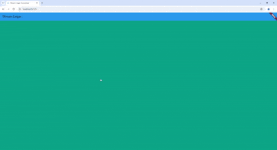

# stream_nama

A new Flutter project.

## Getting Started

Soal 3

1. yield* digunakan untuk meneruskan semua nilai yang dihasilkan oleh Stream.periodic ke stream yang dihasilkan oleh getColor. Setiap kali Stream.periodic memancarkan nilai baru, nilai tersebut akan langsung dihasilkan oleh getColor juga.
2. kode ini bertujuan untuk menghasilkan stream dari objek Color yang memancarkan warna baru setiap detik. Warna yang dipancarkan ditentukan oleh waktu yang telah berlalu dan akan berulang jika waktu melebihi jumlah warna yang tersedia dalam array colors.

Soal 4 

 

Soal 5

1. Perbedaan antara listen dan await for terletak pada cara mereka menangani aliran data dari Stream. Metode listen digunakan untuk mendaftar ke Stream dan menerima data secara asinkron tanpa menghentikan eksekusi kode setelahnya, memungkinkan untuk terus menjalankan kode lain sambil menunggu data. Sebaliknya, await for digunakan dalam konteks fungsi async untuk menunggu dan memproses setiap item dari Stream secara berurutan, menghentikan eksekusi sampai data baru tersedia, sehingga lebih cocok untuk situasi di mana urutan pemrosesan penting.